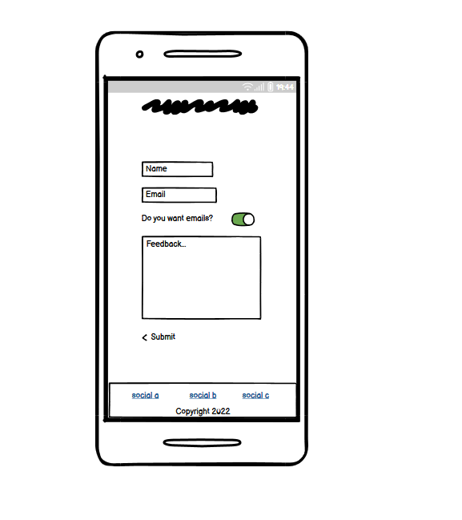
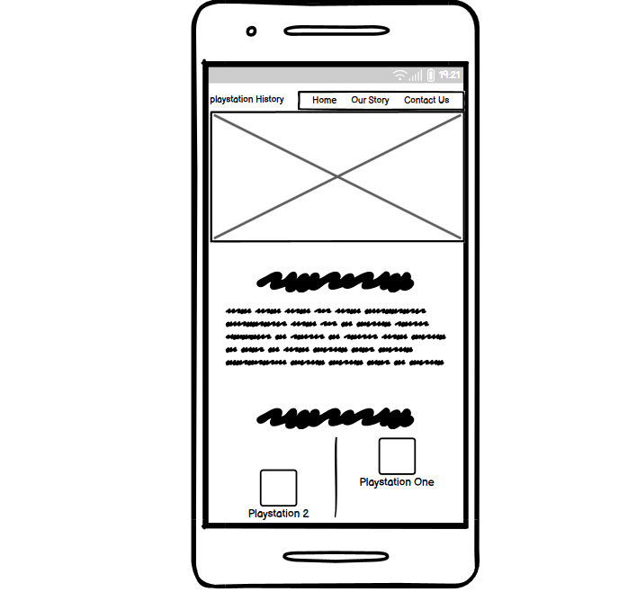

# Welcome to the Playstation History Site

Playstation History is a website documenting a brief history of Sony's Playstation Consoles. This website is intended to give visitors some insight on the last few years of the console, and share facts or information that people might not already know. It showcases some basic Web Development concepts with HTML and CSS.

## Getting Started
To view the site, simply open the index.html file in a web browser, or find the site live here, and usable on all screen sizes: https://itsthebravo.github.io/JohnPMcGrath_Portfolio_Project_1/

## Wireframe planning

## Features
The website is in three sections, all accessible via scrolling or the navigation bar. Aimed to make it as easy to read as possible by having all content on a single page. The site includes a Navigation bar, Information overview section, a timeline with some sample content, and a contact section.

### Existing Features

#### Navigation Bar
* The navbar is a horizontal menu that appears at the top of the page and allows users to navigate to different sections of the site. It is typically created using an unordered list of links, and is often styled with CSS to make it more visually appealing.
* Featured at the top of the page, the fully responsive navigation bar includes 4 links to access to the Home, Story, Timeline, and Contact for easy navigation.
* The navigation bar is horizontal for tablet and desktop screensizes, but is stacked vertically on mobile devices, for optimal viewing experience.

#### Our Story
* This section contains a picture and a text overlay to see what they can expect from the rest of the website. The brushed glass effect is made using the blur value on the backdrop filter property. You can use this to make a blur of varying degrees or other graphical effects behind an element, and was inspired by another project I worked on previously, shown here: https://itsthebravo.github.io/flexbox-company-homepage/
* This section shows the user a large image with Playstation branding to catch their attention.

#### Timeline 
* A timeline is a graphical representation of a chronological sequence of events. It is often used to display the history of a company or organization, or to show the progression of a project.
* This section shows a history of playstation, with three different sections that make it up. "Right Side" and "Left Side" are used to shift content left or right of the center timeline bar. The bar itself uses the ::after pseudo element, to add the cosmetic bar to the timeline element.
* The bar changes from left and right to just left side on mobile devices, for easier readability.

#### Contact page
* The contact page allows users to get in touch with the owner of the website. 
* It includes a form that users can fill out to send a message, as well as contact information such as the website owner's email address and phone number.

## Built with 
*   HTML - The markup language used to structure the content of the website
*   CSS - The stylesheet language used to control the appearance of the website

## Author
John-Paul McGrath 

## Acknowledgments
* W3Schools for providing helpful resources on HTML and CSS. Specifically, I used https://www.w3schools.com/howto/howto_css_timeline.asp for help on making my timeline, I researched pieces of the code such as the timeline bar, I learned how to use the ::after psuedo element, and I built around it and changed it to make it my own.
* The Love Running sample site from code institute, I took inspiration for the structure of the README and the layout of the pages.
* I took inspiration from a site I made for a codecademy project, some styles and patterns: https://itsthebravo.github.io/flexbox-company-homepage/

