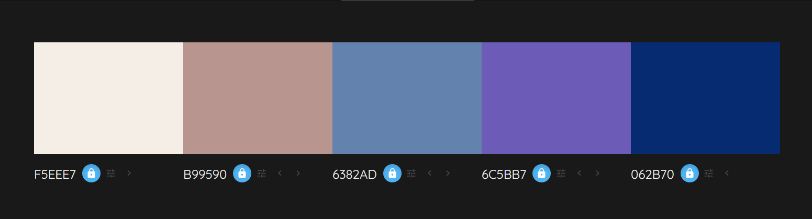
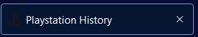

# Welcome to the Playstation History Site

Playstation History is a website documenting a brief history of Sony's Playstation Consoles. This website is intended to give visitors some insight on the last few years of the console, and share facts or information that people might not already know. It showcases some basic Web Development concepts with HTML and CSS.

## Getting Started

To view the site, simply open the index.html file in a web browser, or find the site live here, and usable on all screen sizes: https://itsthebravo.github.io/JohnPMcGrath_Portfolio_Project_1/

## User Experience (UX) 

### Initial Discussion

Playstation History is a website where users can visit to see a past to present showing of different playstation consoles. 

#### Key information for the site

* What the site is about
* What consoles have been released in the past
* What consoles will come next 
* A way to contact to ask questions or give recommendations

### User Stories

#### Client goals

* To be able to view the website on a wide array of devices
* To see what consoles are available and what consoles are coming next
* To be able to contact the site owner with questions or to give recommendations

### First time user goals

* I want to see what the site is about
* I want to see information about past playstation consoles
* I want to be able to ask questions or give my own feedback
* I want to be able to find the social media pages

### Returning visitor goals

* I want to see the latest information on the consoles
* I want to see information on what is coming next

### Frequent visitor goals

* I want to be able to give suggestions for future additions

## Design 

### Color scheme

I wanted to use colors familiar with the brand, so I chose a selection of blues and purple for the site.

### Typography 

Google fonts was used to import the fonts used in this site.

I chose Nunito Sans for bodies of text, and Overpass for headings. I used the site https://fontjoy.com/ to find fonts that had a good pairing together.

### Wireframe site layout

#### Wireframe for top page

#### Wireframe for timeline

#### Wireframe for form

## Features
The website is in three sections, all accessible via scrolling or the navigation bar. Aimed to make it as easy to read as possible by having all content on a single page. The site includes a Navigation bar, Information overview section, a timeline with some sample content, and a contact section.

The whole page is responsive and has: 
* A favicon in the browser tab.

* The title at the top of the page, this also acts as a link back to the home page, useful if you reach the 404 page.

### Existing Features

#### Navigation Bar

* The navbar is a horizontal menu that appears at the top of the page and allows users to navigate to different sections of the site. It is typically created using an unordered list of links, and is often styled with CSS to make it more visually appealing.
* Featured at the top of the page, the fully responsive navigation bar includes 4 links to access to the Home, Story, Timeline, and Contact for easy navigation.
* The navigation bar is horizontal for tablet and desktop screensizes, but is stacked vertically on mobile devices, for optimal viewing experience.

#### Our Story

* This section contains a picture and a text overlay to see what they can expect from the rest of the website. The brushed glass effect is made using the blur value on the backdrop filter property. You can use this to make a blur of varying degrees or other graphical effects behind an element, and was inspired by another project I worked on previously, shown here: https://itsthebravo.github.io/flexbox-company-homepage/
* This section shows the user a large image with Playstation branding to catch their attention.

#### Timeline 

* A timeline is a graphical representation of a chronological sequence of events. It is often used to display the history of a company or organization, or to show the progression of a project.
* This section shows a history of playstation, with three different sections that make it up. "Right Side" and "Left Side" are used to shift content left or right of the center timeline bar. The bar itself uses the ::after pseudo element, to add the cosmetic bar to the timeline element.
* The bar changes from left and right to just left side on mobile devices, for easier readability.

#### Contact Page

* The contact page allows users to get in touch with the owner of the website. 
* It includes a form that users can fill out to send a message, as well as contact information such as the website owner's email address and phone number.

## Technologies Used 

### Languages Used
*   HTML - The markup language used to structure the content of the website
*   CSS - The stylesheet language used to control the appearance of the website

### Frameworks, Libraries and Programs used

Balsamiq - To create the wireframes.

Git - For version control.

Github - For storing code for the site.

Google fonts - To import fonts used for the website.

Font Awesome - For the iconography of the website.

Google Dev tools - to troubleshoot and test features, solve issues with responsiveness and styling.

Am I responsive? - To show the website image on a range of devices.

## Deployment & Local Development

### Deployment 

This site is deployed using Github Pages - [Playstation History](https://itsthebravo.github.io/JohnPMcGrath_Portfolio_Project_1/)

To Deploy the site using Github Pages: 

1. Login (or signup) to Github.
2. Go to the repository for this project, ItsTheBravo/JohnPMcGrath_Portfolio_Project_1.
3. Click the settings Button.
4. Select Pages in the left hand navigation menu.
5. From the source dropdown select main branch and press save.
6. The site has now been deployed, please note that this process may take a few minutes before the site goes live.

### Local Development

#### How to Fork

To fork the repository: 

1. Login (or signup) to Github.
2. Go to the repository for this project, ItsTheBravo/JohnPMcGrath_Portfolio_Project_1.
3. Click the fork button in the top right corner. 

#### How to Clone

1. Login (or signup) to Github.
2. Go to the repository for this project, ItsTheBravo/JohnPMcGrath_Portfolio_Project_1.
3. Click on the code button, select whether you would like to clone with HTTPS, SSH, or Github CLI and copy the link shown.
4. Open the terminal in your code editor and change the current working directory to the location you want to use for the cloned directory.
5. Type 'git clone' into the terminal and then paster the link you copied in step 3. Press enter.

## Testing 

* Automated Testing
    * [W3C Validator](https://validator.w3.org/nu)
    * [CSS Validator])(https://jigsaw.w3.org/css-validator/validator)
    * [Lighthouse](https://developer.chrome.com/docs/lighthouse/overview/)
    * [Wave](https://wave.webaim.org)

Testing was ongoing throughout the entire build. I utilised Chrome Developer Tools whilst building to pinpoint and troubleshoot any issues as I went along.

I used Firefox Developer tools to inspect the page at every stage to make sure each section is fully responsive on a variety of different screen sizes and devices. I also physically tested the site on different devices of varying sizes.

## Author
John-Paul McGrath 

## Credits

### Code Used

* W3Schools for providing helpful resources on HTML and CSS. Specifically, I used https://www.w3schools.com/howto/howto_css_timeline.asp for help on making my timeline, I researched pieces of the code such as the timeline bar, I learned how to use the ::after psuedo element, and I built around it and changed it to make it my own.
* The Love Running sample site from code institute, I took inspiration for the structure of the README and the layout of the pages.
* I took inspiration from a site I made for a codecademy project, some styles and patterns: https://itsthebravo.github.io/flexbox-company-homepage/

### Media 
* Playstation Images or Logos - Taken from Wikipedia or the official Playstation Site.

### Acknowledgements 
* My Code institute Mentor Rory Patrick Sheridan for giving me guidance throughout the project
* The rest of my class and tutors for providing support and assistance in slack and in the team meetings.
