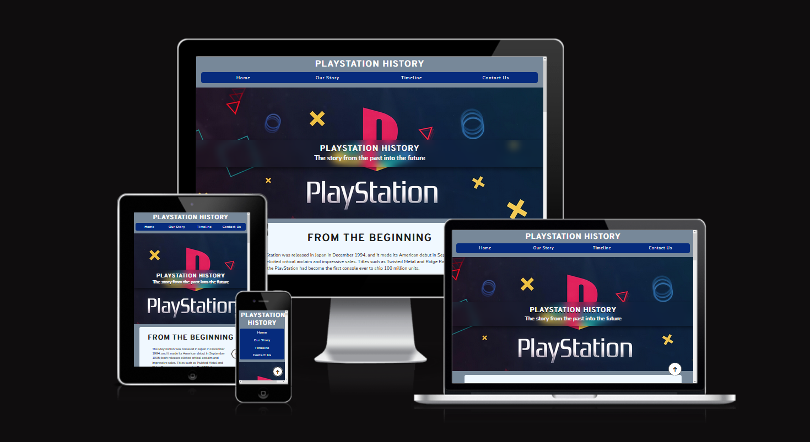

# Welcome to the Playstation History Site

The Playstation History website is a simple, informative website that documents the history of Sony's Playstation consoles. The main goal of this project is to provide visitors with a brief overview of the last few years of the Playstation console, and to share facts and information that they might not already know.

To achieve this goal, I have used HTML and CSS to create a visually appealing and user-friendly website that showcases the key features and milestones of each Playstation console. The website includes a timeline that displays the history of the Playstation from 1996 to 2020, and a contact page that allows visitors to get in touch with us.

In addition to providing information about the Playstation console, this project aims to demonstrate some basic web development concepts, such as HTML and CSS. By creating a functional and attractive website, I hope to show that it is possible to create simple yet effective web projects using these technologies.

Overall, the Playstation History website is intended to be a fun and educational resource for anyone interested in the history of the Playstation console. I hope that visitors will enjoy exploring the website and learning more about the Playstation's journey from past to present.

## Getting Started

To view the site, simply open the index.html file in a web browser, or find the site live here, and usable on all screen sizes: https://itsthebravo.github.io/JohnPMcGrath_Portfolio_Project_1/

## User Experience (UX) 

### Initial Discussion

Playstation History is a website where users can visit to see a past to present showing of different playstation consoles. 

#### Key information for the site

* What the site is about
* What consoles have been released in the past
* What consoles will come next 
* A way to contact to ask questions or give recommendations

### User Stories

#### Client goals

* To be able to view the website on a wide array of devices
* To see what consoles are available and what consoles are coming next
* To be able to contact the site owner with questions or to give recommendations

#### First time user goals

* I want to see what the site is about
* I want to see information about past playstation consoles
* I want to be able to ask questions or give my own feedback
* I want to be able to find the social media pages

#### Returning visitor goals

* I want to see the latest information on the consoles
* I want to see information on what is coming next

#### Frequent visitor goals

* I want to be able to give suggestions for future additions

## Design 

### Color scheme

I wanted to use colors familiar with the brand, so I chose a selection of blues and purple for the site.

### Typography 

Google fonts was used to import the fonts used in this site.

I chose Nunito Sans for bodies of text, and Overpass for headings. I used the site https://fontjoy.com/ to find fonts that had a good pairing together.

### Wireframe site layout

#### Wireframe for top page

#### Wireframe for timeline

#### Wireframe for form

## Features
The website is in three sections, all accessible via scrolling or the navigation bar. Aimed to make it as easy to read as possible by having all content on a single page. The site includes a Navigation bar, Information overview section, a timeline with some sample content, and a contact section.

The whole page is responsive and has: 
* A favicon
A favicon is a small icon that appears in the browser tab when a website is open. The Playstation History website includes a favicon in the browser tab, which helps to identify the website and make it easier to find in a list of open tabs.

* The title at the top of the page, this also acts as a link back to the home page, useful if you reach the 404 page.

### Existing Features

#### Navigation Bar

* The navigation bar helps users to navigate the site and find the content that they are looking for. The navigation bar is located at the top of the homepage, and it is designed to be easy to use and responsive so that it can be viewed on devices of different sizes.

* The navigation bar is styled using CSS to give it a clean and modern appearance. The navigation bar includes a logo that acts as a link back to the homepage, as well as a list of links that provide access to different sections of the website. The navigation bar is also designed to be responsive, so it adjusts its layout and appearance to fit the size of the user's device.

#### Hero Image 

* The hero image is a large, visually striking image that is designed to catch the attention of visitors and give them a sense of what they can expect from the rest of the website. The hero image is located at the top of the homepage, and it is accompanied by a text overlay that provides a brief overview of the website's content.

* The hero image is implemented using the img element in HTML, and it is styled using CSS to give it a brushed glass effect. This effect is achieved using the backdrop-filter property, which allows developers to apply a blur or other graphical effects behind an element. In this case, the backdrop-filter property is set to a blur value of "5px" to give the hero image a subtle, blurry appearance. I used this with reference from another project I done before, shown here: https://itsthebravo.github.io/flexbox-company-homepage/

* The hero image is an important feature of the Playstation History website, as it serves as a strong visual introduction to the rest of the site. By showing a large, attention-grabbing image with Playstation branding, the hero image helps to set the tone for the rest of the website and draw users in to explore the rest of the content. The text overlay also helps to give users a quick overview of what they can expect to find on the website, further engaging them and encouraging them to explore the site further.

#### Our Story

* The Our story section on the Playstation History website is a feature that provides a brief overview of the content and purpose of the site. It is located below the hero image on the homepage, and it is designed to be easy to read and understand.

* The our story section is implemented using a combination of HTML and CSS, and it is designed to be responsive so that it can be viewed on devices of different sizes. The overview section includes a heading, a short paragraph of text, and a bullet point list that highlights some of the key features of the website.

* The our story section serves as an important introduction to the Playstation History website, providing users with a quick overview of playstation and other details about that they may find on the site.
#### Timeline 

* A timeline is a graphical representation of a chronological sequence of events. It is often used to display the history of a company or organization, or to show the progression of a project.
* The timeline section of the website displays the history of the PlayStation console from 1996 to 2020. The timeline consists of a series of events, each containing a title, description, and date. The events are displayed on alternating sides of the timeline, with yhe oldest dates at the top down to the most recent at the bottom.
* Each event on the timeline is contained within a div element with the class "left-side" or "right-side". The title of the event is contained within an h3 element, and the description is contained within a p element. An hr element is used to separate each event.
* To style the timeline with CSS, I used various properties such as width, float, font-size, and color, plus relative positioning to make sure the items were on alternating sides of the timeline. I also used the hr element to add a horizontal line between each event.
* The bar changes from left and right to just left side on mobile devices, for easier readability.

##### The after element in timeline

I spent the most time researching and changing this part, so I wanted to give it it's own section.

* The ::after pseudo-element is used to insert a thin, vertical line after the element with the id of "timeline". This line is intended to serve as a visual separator between the events on the timeline.

* To accomplish this, the content property is used to specify the content to be inserted, which in this case is an empty string. This means that no content is actually being inserted, and the pseudo-element is being used solely for its decorative properties.

* The position property is set to absolute, which means that the position of the pseudo-element is determined relative to its closest positioned ancestor element, if any; otherwise, it is determined relative to the initial containing block.

* The width property is used to specify the width of the line, which is set to 5px. The background-color property is used to specify the color of the line, which is set to a light beige color (#F5EEE7).

* The top, bottom, and left properties are used to position the line vertically and horizontally within the timeline. The top property is set to 6%, which means that the top of the line is positioned 6% down from the top edge of the timeline. The bottom property is set to 0, which means that the bottom of the line is positioned at the bottom edge of the timeline. The left property is set to 50%, which means that the left edge of the line is positioned at the center of the timeline.

* The margin-left property is used to adjust the horizontal position of the line. It is set to -3px, which means that the left edge of the line is shifted 3px to the left. This is done to ensure that the line is centered within the timeline.

#### Contact Page

* The contact form on the Playstation History website is a feature that allows users to send a message to the site owner. It is located on the "Contact" section of the website, and it is designed to be easy to use and secure.

* The contact form is implemented using the form element in HTML, along with a series of input elements for the various fields (e.g., name, email address, message). The form is styled using CSS to match the overall design of the website, and it is designed to be responsive so that it can be used on devices of different sizes.

* To submit the form, users simply need to enter their name, email address, and message in the relevant fields, and then click the "Submit" button. The form is validated on the client-side to ensure that all required fields are filled out.

* The contact form is an important feature that allows users to get in touch with the site owner and provide feedback or ask questions about the Playstation History website.

* In summary, the contact form on the Playstation History website is a user-friendly and secure feature that allows users to easily communicate with the site owner. It is an important part of the website, and it helps to make the site more interactive and engaging for visitors.

## Technologies Used 

### Languages Used
*   HTML - The markup language used to structure the content of the website
*   CSS - The stylesheet language used to control the appearance of the website

### Frameworks, Libraries and Programs used

Balsamiq - To create the wireframes.

Git - For version control.

Github - For storing code for the site.

Google fonts - To import fonts used for the website.

Font Awesome - For the iconography of the website.

Google Dev tools - to troubleshoot and test features, solve issues with responsiveness and styling.

Am I responsive? - To show the website image on a range of devices.

### Git and Version Control

Git is a version control system that is used to track changes in computer files and coordinate work on those files among multiple people. It is a powerful tool that allows developers to work on a project concurrently, while keeping track of changes and ensuring that the project is well-organized and easy to maintain.

In the Playstation History project, I used git to track changes to the source code and coordinate work among the development team. To do this, I used a branching model that involves creating feature branches for each new feature or bug fix, and then merging those branches back into the main branch when they are ready.

Feature branches allow us to work on new features or fixes independently, without affecting the main branch. This makes it easier to develop and test new features, and helps to ensure that the main branch is always stable and ready for deployment. When a feature branch is ready to be merged into the main branch, it is first reviewed by the development team to ensure that it meets the project's standards and specifications.

To commit changes to the git repository, we use the git commit command, which stores a snapshot of the project's source code at a particular point in time. Each commit includes a message that describes the changes that were made in that commit. This allows us to track the progress of the project and understand how it has evolved over time.

By using git and version control, I was able to manage the Playstation History project more efficiently and effectively, and ensure that the source code is well-organized and easy to maintain.

## Deployment & Local Development

### Deployment 

This site is deployed using Github Pages - [Playstation History](https://itsthebravo.github.io/JohnPMcGrath_Portfolio_Project_1/)

To Deploy the site using Github Pages: 

1. Login (or signup) to Github.
2. Go to the repository for this project, ItsTheBravo/JohnPMcGrath_Portfolio_Project_1.
3. Click the settings Button.
4. Select Pages in the left hand navigation menu.
5. From the source dropdown select main branch and press save.
6. The site has now been deployed, please note that this process may take a few minutes before the site goes live.

### Local Development

#### How to Fork

To fork the repository: 

1. Login (or signup) to Github.
2. Go to the repository for this project, ItsTheBravo/JohnPMcGrath_Portfolio_Project_1.
3. Click the fork button in the top right corner. 

#### How to Clone

1. Login (or signup) to Github.
2. Go to the repository for this project, ItsTheBravo/JohnPMcGrath_Portfolio_Project_1.
3. Click on the code button, select whether you would like to clone with HTTPS, SSH, or Github CLI and copy the link shown.
4. Open the terminal in your code editor and change the current working directory to the location you want to use for the cloned directory.
5. Type 'git clone' into the terminal and then paster the link you copied in step 3. Press enter.

## Testing 

Testing is an important part of the development process, as it helps to ensure that the website is functioning as intended and meets the project's specifications. It involves testing the website using a range of test cases and test scenarios to cover all the different features and functionality of the website.

### Automated Testing
    * [W3C Validator](https://validator.w3.org/nu)
    * [CSS Validator])(https://jigsaw.w3.org/css-validator/validator)
    * [Lighthouse](https://developer.chrome.com/docs/lighthouse/overview/)
    * [Wave](https://wave.webaim.org)

### Manual Testing

For my manual tests on the Playstation History website, I created a set of test cases that cover the key features and functionality of the website. These test cases include:

* Testing the timeline to ensure that it displays the correct information for each Playstation console, and that the layout is consistent and easy to read.
* Testing the contact page to ensure that the form is functional and that the correct error messages are displayed when necessary.
* Testing the website's responsiveness to ensure that it looks and functions correctly on different devices and screen sizes.
* Testing the website's performance to ensure that it loads quickly and efficiently.

To perform these tests, I will follow the test cases and test scenarios listed above, and verify that the website functions as intended. Any issues or bugs that are discovered during manual testing will be documented and addressed as part of the development process.

Overall, manual testing is an important step in the development process, as it helps to ensure that the Playstation History website is functional, user-friendly, and meets the project's specifications.

Testing was ongoing throughout the entire build. I utilised Chrome Developer Tools whilst building to pinpoint and troubleshoot any issues as I went along.

I used Firefox Developer tools to inspect the page at every stage to make sure each section is fully responsive on a variety of different screen sizes and devices. I also physically tested the site on different devices of varying sizes.

## Author
John-Paul McGrath 

## Credits

### Code Used

* W3Schools for providing helpful resources on HTML and CSS. Specifically, I used https://www.w3schools.com/howto/howto_css_timeline.asp for help on making my timeline, I researched pieces of the code such as the timeline bar, I learned how to use the ::after psuedo element, and I built around it and changed it to make it my own.
* The Love Running sample site from code institute, I took inspiration for the structure of the README and the layout of the pages.
* I took inspiration from a site I made for a codecademy project, some styles and patterns: https://itsthebravo.github.io/flexbox-company-homepage/

### Media 
* Playstation Images or Logos - Taken from Wikipedia or the official Playstation Site.

### Acknowledgements 
* My Code institute Mentor Rory Patrick Sheridan for giving me guidance throughout the project
* The rest of my class and tutors for providing support and assistance in slack and in the team meetings.
